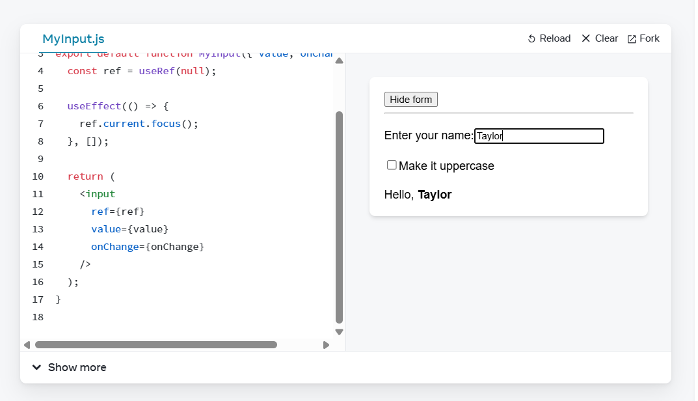
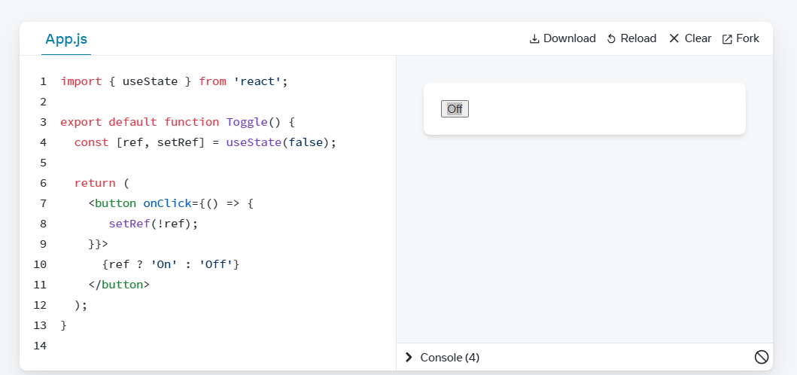
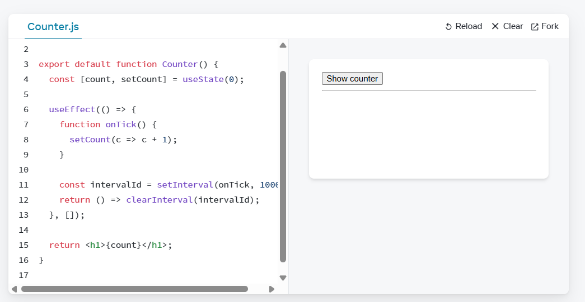
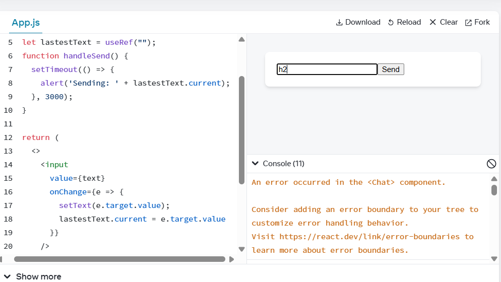
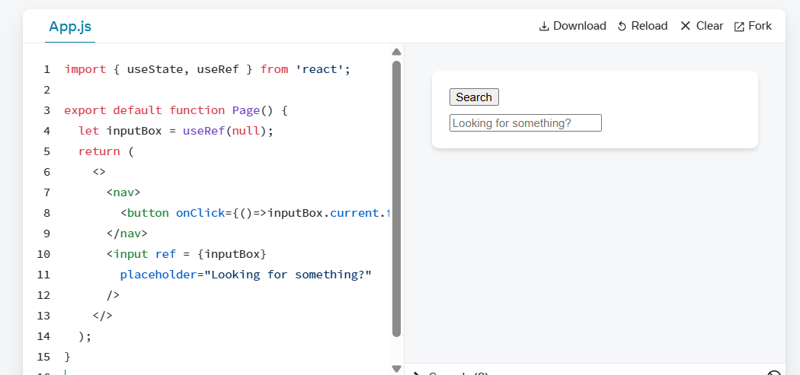
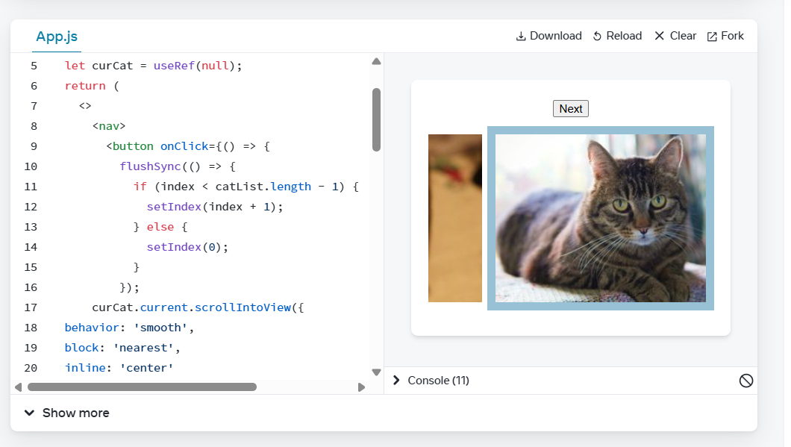
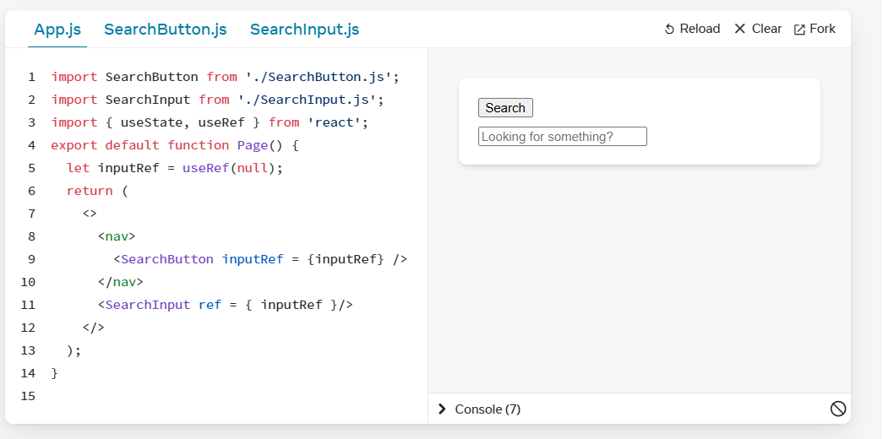

# Challenge 1

# Challenge 2

# Challenge 3

# Challenge 4

# Challenge 5

# Challenge 6

# Challenge 7

# Challenge 8

# What is higher order function and hoc?
A higher-order function is any function that takes another function as an argument or returns a new function.
function logger(fn) {
  return (...args) => {
    return console.log(...args);
  };
}
A Higher-Order Component similarly takes a component as input and returns a new component with extra logic
# What is currying? 
Currying means transforming a function that takes multiple arguments into a chain of functions that each take one argument
Like make the add function
function add(a, b) {
  return a + b;
}
As:
const addCurry = (a) => (b) => a + b;
Invoke this as addCurry(2)(3); 
# What/why custom hooks? 
A custom hook is just a function starting with use that built on top of React’s built-in hooks.We can use custom hook to reuse complex logic across components.
# What is Redux?
Redux is a predictable state container for JavaScript apps. It centralizes app state in a single store 
# What are the advantages and disadvantages of Redux?
Advantages
Predictable state management
Centralized logic makes large apps more maintainable
Integrates well with React by react-redux

Disadvantages
Overkill for small apps
Performance issues if not memoized properly

# How to connect a React component with Redux store?
use: useSelector, useDispatch

function Counter() {
  const count = useSelector((state) => state.count);
  const dispatch = useDispatch();

  return (
    <button onClick={() => dispatch({ type: "INCREMENT" })}>
      Count: {count}
    </button>
  );
}