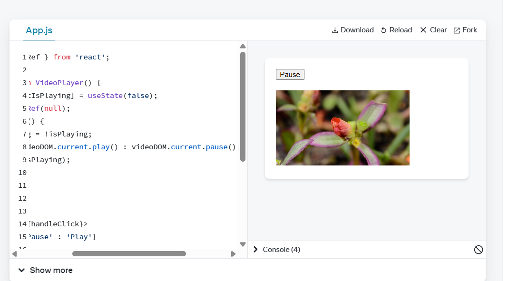

# Challenge 1

# Challenge 2

# Challenge 3

# Challenge 4

# Challenge 5

# Challenge 6

# Challenge 7

# Challenge 8

# Why class method sometimes doesn’t have access to ‘this’? How to solve it?
When you pass a method as a callback, this loses its binding — use function.bind(this) to rebind.

# Explain what lifecycle method is in simple and clear way

Lifecycle methods are special functions in React class components that is invoked when reated, updated, or removed.

# When was functional components introduced? What’s the difference between class and functional components?

Functional components were stateless at first. React Hooks (React 16.8) made them stateful and powerful.