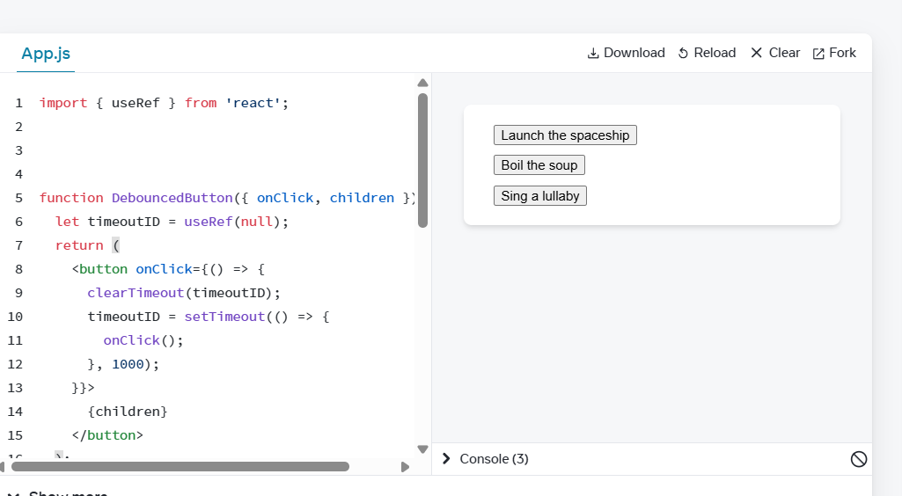

# Challenge 1

# Challenge 2

# Challenge 3

# Challenge 4

# Challenge 5

# Challenge 6

# Challenge 7

# Challenge 8

# How to prevent functional/class components from unnecessary re-rendering?
1. React.memo - Wraps a component to memoize it, compared by shallow comparison
2. useMemo - Memoizes calculated values between renders, so expensive computations don’t run every time.
3. Update state immutably
4. useCallback - Memoizes function references so child components aren’t triggered to re-render because of new function identities.
# Why use useMemo and useCallback with React.memo?
React.memo stops re-rendering only if props don’t change — useCallback/useMemo ensure your props don’t change unnecessarily.

in this code:

const Parent = () => {
  const handleClick = () => console.log("clicked");
  return <Child onClick={handleClick} />;
};

Even if the parent doesn’t change visually, handleClick is recreated each render
# Why is immutability important in React?

1. It makes change detection predictable and avoids subtle UI not updating bugs.

2. Enables performance optimizations like PureComponent, React.memo, and time-travel debugging.